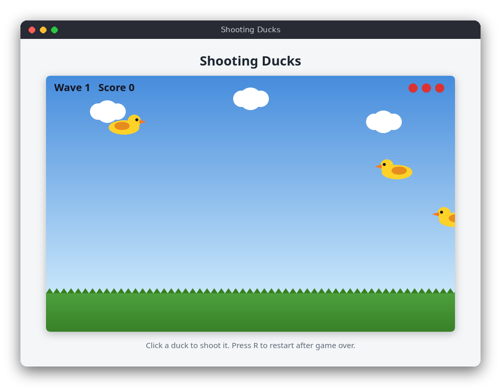

# Shooting Ducks (JavaScript)

Ducks fly across a sky drawn on a canvas, left to right or right to left, bobbing up and down. Click them to shoot. Each wave brings more and faster ducks. A duck that gets away costs a life, and the game ends when all three lives are gone.

The same game is also written in [C](../../c/shooting_ducks) (terminal) and [Python](../../python/shooting_ducks) (pygame).



## Features

- Ducks fly in both directions and bob up and down.
- Click to shoot. Shots are checked against the duck's box.
- Waves: each wave has more ducks (3 + 2 × wave) that are faster and appear more often.
- Three lives: a duck that leaves the screen costs one life.
- 10 points per hit, shown with the wave number and lives.
- A short pause after each cleared wave, and a game over screen with restart.

## How to play

Open `src/index.html` in a browser. No server and no installation are needed.

| Input | Action |
|---|---|
| Click | Shoot at the mouse pointer |
| R or click | Play again (after game over) |

Shoot the ducks before they leave the screen. When a wave is cleared, the next one starts after two seconds.

## How it works

The project has two scripts, loaded one after the other by `index.html` as classic scripts (not modules), so the page also works when opened from disk:

- `src/shooting_ducks.js` holds the rules. It has no DOM code, so the tests can run it in Node.js.
- `src/main.js` draws on the canvas and handles the mouse and keyboard.

**Random numbers.** `createRng` and `nextRandom` implement a linear congruential generator. `nextRandom` returns a number in [0, 1). `createGame(seed)` takes a seed, so the same seed always gives the same game.

**Spawning.** A wave starts with `ducksInWave(wave)` ducks to release. Every `spawnInterval(wave)` seconds (2 s at the start, down to 0.5 s) `spawnDuck` adds one duck just outside the screen. It picks a direction, a speed, a height and a bobbing phase.

**Movement.** `updateGame(game, dt)` moves each duck by `speed * dt`, so the game runs at the same speed on any screen. The height follows a sine wave around `baseY`. `main.js` limits `dt` to 0.1 s, so a background tab does not make the ducks jump.

**Escapes.** A duck that has fully left the screen on the far side is removed and costs a life. When the lives reach zero, `gameOver` becomes `true` and the game stops.

**Hits.** `shootAt(game, x, y)` finds the first duck whose box (10 × 6 field units) contains the point, removes it and adds 10 points. `main.js` converts the click position to field coordinates.

**Waves.** When every duck of the wave has been spawned and removed, `breakTimer` starts a two-second pause. Then the next wave begins.

The field is 100 × 40 units. The canvas is 800 × 500 pixels and scales with the page width.

## Project layout

```
shooting_ducks/
├── README.md
├── screenshot.png
├── package.json            test script (no dependencies)
├── src/
│   ├── index.html          the page
│   ├── style.css           page and colours (light and dark)
│   ├── shooting_ducks.js   the rules: spawning, movement, hits, waves
│   └── main.js             canvas drawing, mouse and keyboard
└── tests/
    └── shooting_ducks.test.js  tests of the rules
```

## Requirements

- A modern browser (Firefox, Chrome, Edge or Safari) to play
- Node.js 18 or newer to run the tests (no npm packages are needed)

## Run

Open `src/index.html` in your browser.

## Test

```sh
npm test
```

The tests check the rules: the random source, spawning, movement over time, hits and misses, escapes, game over and waves.

## Comparison with the other versions

- [C](../../c/shooting_ducks) (terminal, ncurses)
- [Python](../../python/shooting_ducks) (pygame window)
- [JavaScript](../../vanilla_js/shooting_ducks) (browser canvas)

| | C | Python | JavaScript |
|---|---|---|---|
| Interface | ncurses terminal | pygame window | browser page |
| Lines of logic | 98 | 103 | 114 |
| Lines of interface | 135 | 103 | 156 |
| Tests | 10 | 11 | 10 |

The three versions use the same rules and the same random number generator, so a given seed produces the same ducks in each language. The C version keeps the ducks in a fixed array and removes a shot duck by shifting the rest down; Python and JavaScript just use a list, and removing an element is one call. C also has to draw the sky, grass and ducks cell by cell and convert between terminal cells and field coordinates, while the pygame and canvas versions draw shapes at pixel positions. JavaScript has no integer type, so the generator uses `Math.imul` to get the same 32-bit arithmetic that C gets for free from `uint32_t`.

## Ideas for extensions

- Add a bonus for shooting ducks quickly after they appear.
- Make some ducks worth more points, and draw them in a different colour.
- Play a sound when a duck is shot or escapes.
- Save the high score in `localStorage`.
- Add a pause key.
