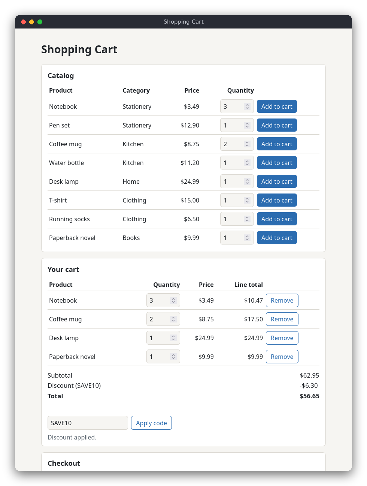

# Shopping Cart (JavaScript)

A shopping cart that runs in a web browser. The page shows an 8-product catalog, your cart with line totals, a discount code box and a checkout form. The Polish name of the project is *Koszyk z zakupami*.



## Features

- A built-in catalog of 8 products with a name, a category and a price
- Add a product with a chosen quantity, change a quantity in the cart, or remove a product
- The cart shows every line with its line total, the subtotal, the discount and the total
- Two discount codes: `SAVE10` takes 10% off any order, `FLAT5` takes 5.00 off orders of 30.00 or more
- Codes are not case-sensitive; an unknown code, or a code whose minimum is not reached, is rejected with a message
- Checkout checks the name and the address, shows an order summary and empties the cart
- Money is stored as whole cents, so the totals are exact

## How to use

No installation is needed. Open `src/index.html` in a browser (double-click the file, or drag it into a browser window).

1. In the **Catalog**, choose a quantity and press **Add to cart**.
2. In **Your cart**, change a quantity and press Enter or leave the field to update the cart, or press **Remove**.
3. Type `SAVE10` or `FLAT5` in the discount box and press **Apply code**.
4. In **Checkout**, type your full name and delivery address and press **Place order**. The order summary appears below the form, and the cart is emptied.

## How it works

**Data.** `CATALOG` is an array of objects with `name`, `category` and `priceCents`. `DISCOUNT_CODES` is an array of objects with a `percent`, or an `amountCents` with a `minOrderCents`. A cart is a plain object: `quantities` holds one number per catalog product, and `discount` holds the applied code or `null`.

**Money in cents.** Every price and total is an integer number of cents: `349` means $3.49. JavaScript numbers are 64-bit floating-point values, and `0.1 + 0.2` gives `0.30000000000000004`, so decimal money cannot be stored in them directly. Whole numbers below 2^53 are exact, so the cents never lose precision. `formatMoney` in `main.js` turns the number into text only for display.

**Rules** (`src/shopping_cart.js`, no DOM code):

1. `subtotalCents` adds `priceCents * quantity` for each product.
2. A percentage discount is `Math.floor((subtotal * percent + 50) / 100)`. The `+ 50` rounds half up to the nearest cent, so 10% of $3.49 is 35 cents.
3. A fixed discount is the amount, but never more than the subtotal. It is applied only when the subtotal reaches the code's minimum. If the cart later drops below the minimum, `discountCents` returns 0.
4. `totalCents` is the subtotal minus the discount.
5. `validateName` and `validateAddress` throw an `Error` with a message when a field is invalid. Names need 2-40 characters and a letter (any language); addresses need 5-80 characters and a digit (the house number).

The rules throw an `Error` when an action is not allowed, and `main.js` catches it and shows the message on the page.

**The page** (`src/main.js`). `state` holds the cart and the last order. Each form and button calls a small function that changes the cart with a rule from the logic file, and then `render()` draws the catalog, the cart, the totals and the summary again from `state`. The page does not keep its own copy of the cart. The two script files are loaded as classic scripts, so the page works when you open `index.html` directly from disk, without a web server.

## Project layout

```
README.md                    this file
screenshot.png               the browser screenshot above
package.json                 the test command (npm test); no dependencies
src/index.html               the page: catalog, cart, discount box, checkout form
src/style.css                the layout and colors (light and dark mode)
src/shopping_cart.js         the rules: catalog data, cart operations, discounts, totals, validation
src/main.js                  the page logic: drawing the tables, handling the forms
tests/shopping_cart.test.js  tests of the rules, using node:test
```

## Requirements

- A modern web browser (Firefox, Chrome, Edge, Safari) to use the page
- Node.js 18 or newer to run the tests (no npm packages are needed)

## Run

Open the file in a browser:

```sh
xdg-open src/index.html        # Linux; on macOS use: open src/index.html
```

## Test

```sh
npm test
```

The tests check the catalog, adding and removing items, the quantity limit, both kinds of discount (including rounding and the minimum order), unknown codes, clearing the cart, and the name and address rules. They do not need a browser.

## Comparison with the other versions

- [C](../../c/shopping_cart)
- [Python](../../python/shopping_cart)

| | C | Python | JavaScript |
|---|---|---|---|
| Interface | terminal menu | terminal menu | browser page |
| Lines of logic | 163 | 81 | 90 |
| Lines of interface | 265 | 130 | 205 |
| Tests | 12 | 17 | 12 |

The browser version never asks for input in a loop: it waits for clicks and form submits, and each handler changes the state and redraws the page. Objects and arrays are created and dropped by the garbage collector, so there is no memory to free, unlike C. JavaScript has no integer type, so the cents rule matters even more here than in Python, and `Math.floor` replaces the integer division. The logic file has no DOM access, so the same rules could be tested with Node.js without a browser.

## Ideas for extensions

- Save the cart in `localStorage`, so it is still there after the page is reloaded
- Show the stock left for each product and disable **Add to cart** when it is sold out
- Add a search box that filters the catalog by name or category
- Support several discount codes at once, with a rule for which one wins
- Add a receipt that can be printed (`window.print()` with a print stylesheet)
