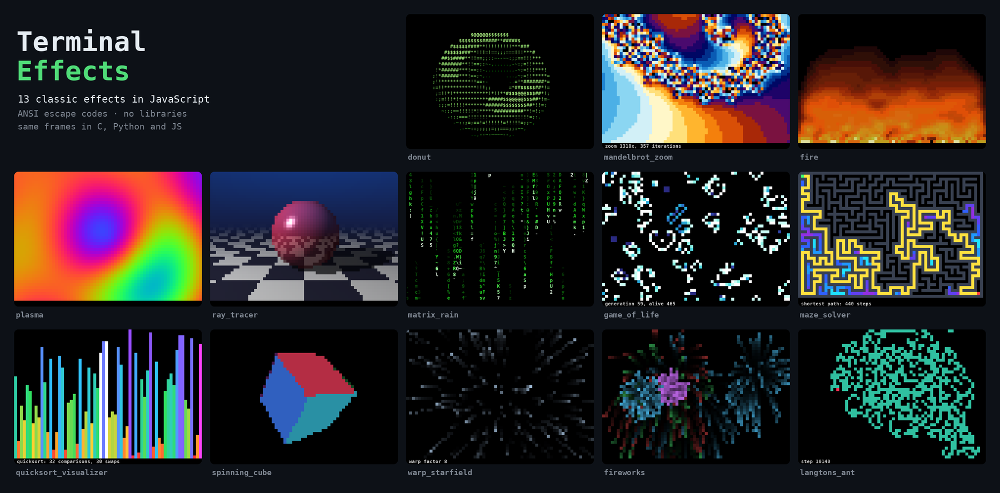

# Terminal Effects (JavaScript)

Thirteen small programs that turn the terminal into a screen: 3D graphics, fractals, simulations and algorithms you can watch. They use only the standard library and ANSI escape codes. Each effect is one short file that you can read in one sitting.

The same effects are also written in [C](../../c/terminal_effects) and [Python](../../python/terminal_effects). All three versions print **exactly the same frames, byte for byte**, so the languages can be compared line by line.



## Effects

| Effect | What you see | What you learn | Level |
|---|---|---|---|
| [`donut`](src/donut.js) | A spinning donut drawn with ASCII characters | Parametric surfaces, rotation, perspective projection, z-buffer, light from surface normals | ★★★ |
| [`mandelbrot_zoom`](src/mandelbrot_zoom.js) | A nearly 12,000× zoom into the Mandelbrot set | Complex numbers, the escape-time algorithm, color palettes | ★★ |
| [`fire`](src/fire.js) | Flames rising from glowing embers | Averaging neighbors (a blur), palettes | ★ |
| [`plasma`](src/plasma.js) | Flowing rainbow colors | Sine waves, mixing RGB colors | ★ |
| [`ray_tracer`](src/ray_tracer.js) | A shiny sphere over a checkered floor | Vectors, ray–sphere and ray–plane intersection, shadows, reflections, recursion | ★★★ |
| [`matrix_rain`](src/matrix_rain.js) | The falling green code from *The Matrix* | State kept per column, color gradients | ★ |
| [`game_of_life`](src/game_of_life.js) | Conway's Game of Life, cells colored by age | Cellular automata, double buffering, a wrapping board | ★ |
| [`maze_solver`](src/maze_solver.js) | A maze carved live and then solved | Depth-first search with a stack, breadth-first search with a queue, path reconstruction | ★★ |
| [`quicksort_visualizer`](src/quicksort_visualizer.js) | Quicksort sorting 64 bars, one frame per swap | Recursion, Lomuto partitioning, the Fisher–Yates shuffle | ★★ |
| [`spinning_cube`](src/spinning_cube.js) | A lit cube rotating around three axes | Rotation in 3D, z-buffer, lighting with normals | ★★ |
| [`warp_starfield`](src/warp_starfield.js) | Flying through stars faster and faster | Perspective division (x / z), motion streaks | ★ |
| [`fireworks`](src/fireworks.js) | Rockets that burst into falling sparks | Particles, velocity, gravity, drag, fading trails | ★★ |
| [`langtons_ant`](src/langtons_ant.js) | An ant whose two rules build a highway | Simple rules producing complex behavior | ★ |

## Requirements

- Node.js 18 or newer, no npm packages
- A terminal with 24-bit color and UTF-8, at least 64×23 characters (most modern terminals: GNOME Terminal, Konsole, iTerm2, Windows Terminal, the VS Code terminal)

## Run

```sh
node src/donut.js
node src/maze_solver.js
```

Every effect loops until you press **Ctrl+C**. A number after the name stops it after that many frames, e.g. `donut 100`. With the environment variable `NO_SLEEP=1` it does not wait between frames, which is what the tests and the benchmark use.

## Test

The tests run every effect for 20 frames without pauses, check that each frame was drawn and that the terminal was restored, and check the random number generator. They use only the built-in test runner:

```sh
npm test
```

## Project layout

```
package.json          marks the files as ES modules and defines `npm test`
src/term.js           the shared helper: canvases, frame loop, random numbers
src/<effect>.js       one file per effect
tests/                tests for the built-in node:test runner
```

The effects run in Node.js, not in the browser: they write to the terminal just like the C and Python versions.

## How it works

### Drawing in the terminal

The terminal understands special byte sequences that start with the escape character (`\033`, also written `\x1b`). These are the only ones the effects need:

| Sequence | Meaning |
|---|---|
| `\033[2J` | clear the screen |
| `\033[H` | move the cursor to the top-left corner |
| `\033[?25l` / `\033[?25h` | hide / show the cursor |
| `\033[38;2;R;G;Bm` | set the text color to an RGB color |
| `\033[48;2;R;G;Bm` | set the background color to an RGB color |
| `\033[0m` | reset colors |
| `\033[K` | clear to the end of the line |

Every frame starts with `\033[H` and overwrites the previous one in place, instead of clearing the screen, so nothing flickers. A whole frame is built first and written in one go. A color code is only written when the color changes.

### Square pixels from half blocks

A character cell is about twice as tall as it is wide. The character `▀` (upper half block) is painted with the text color in its top half and with the background color in its bottom half, so one cell can show two square pixels. A 64×22 character area becomes a 64×44 pixel canvas. Two effects (`donut` and `matrix_rain`) draw characters instead, on a 64×22 text canvas.

### The shared helper

The common terminal code lives in one small module, `term`. The effects contain only their own algorithm. (JavaScript spells the names in camelCase: `showPixels`, `showText`.)

| Name | What it does |
|---|---|
| `start(delay)` | reads the optional frame limit, hides the cursor, clears the screen, makes Ctrl+C restore the terminal |
| `pixels[y][x]` | the 64×44 pixel canvas, colors as `0xRRGGBB` |
| `text[y][x]`, `ink[y][x]` | the 64×22 text canvas: a character and its color |
| `show_pixels(status)` / `show_text(status)` | draws the canvas plus a status line, then waits until the frame's time is up |
| `seed(s)`, `rnd(n)` | a random integer from 0 to n − 1 |

The frame delay is a target: the helper subtracts the time spent computing the frame, so an effect keeps its speed as long as the computer keeps up.

### The same output in three languages

To make the three versions print the same bytes, they follow a few rules:

- **Their own random numbers.** `rand()`, `random` and `Math.random` all give different numbers, so every version uses the same tiny generator (a linear congruential generator): `state = state × 1103515245 + 12345 (mod 2³²)`, and `rnd(n)` returns bits 16–31 of `state` modulo `n`. JavaScript needs `Math.imul` and `>>> 0` to multiply 32-bit integers exactly.
- **The same number types.** All three compute with 64-bit IEEE 754 floats (`double` in C). Adding, multiplying, dividing and square roots are exactly rounded, so they give the same bits everywhere. The C build adds `-ffp-contract=off` so that the compiler does not fuse `a * b + c` into one instruction with different rounding.
- **The same rounding.** `(int)x` in C, `int(x)` in Python and `Math.trunc(x)` in JavaScript all round toward zero. Integer division is only done on non-negative numbers, where C's `/`, Python's `//` and `Math.floor(a / b)` agree.
- **The same order of random calls.** C does not say in which order a function's arguments are evaluated, so random numbers are never drawn twice inside one function call.

`sin`, `cos` and `sqrt` come from different math libraries, but no frame came out different in 2,000 frames of every effect. The script [`scripts/compare-terminal-effects.sh`](../../../scripts/compare-terminal-effects.sh) checks this.

## The effects in detail

### donut
The donut (a torus) is a circle of radius 1 swept around an axis at distance 2. Two angles walk over its surface: `j` goes around the tube and `i` goes around the ring. Every point is rotated by two angles `A` and `B` that grow every frame, and then projected onto the screen by dividing by its distance: `x' = K * x / z`. Several points can land on the same character, so a **z-buffer** remembers the nearest one. The brightness `L` is the dot product of the surface normal with the direction of the light. It picks one of the characters `.,-~:;=!*#$@`: the more light, the denser the character.

### mandelbrot_zoom
For every pixel take the complex number `c` it represents and iterate `z = z² + c` starting from `z = 0`. If `|z|` grows past 2 the point escapes, and the number of steps it took picks the color. Points that never escape belong to the set and are drawn black. Each frame shrinks the viewed area by 7% around a point in the "seahorse valley" and allows more iterations, because the edge needs more detail the deeper you go. After 130 frames (about 11,600×) the zoom starts again.

### fire
Two hidden rows below the screen are filled with random embers (hot or cold). Every visible pixel becomes the sum of the three pixels below it and the one two rows down, times `31/129`, which is a little less than an average. Heat therefore spreads upward, blurs and cools down. The heat value (0–36) picks a color from the palette of the PlayStation version of Doom.

### plasma
Each pixel's color comes from four sine waves added together: a horizontal one, a vertical one, a diagonal one and a circular one, all moving with time `t`. The sum is turned into a hue, and the hue into red, green and blue with three sines shifted by a third of a circle (`2.094` radians).

### ray_tracer
One ray leaves the eye through every pixel. The program finds where it first hits the sphere (by solving a quadratic equation) or the floor (by dividing by the ray's height). On the sphere it adds diffuse light (normal · light), a specular highlight, and 30% of a reflected ray traced recursively. On the floor it picks a checker color, darkens it if the sphere blocks the light (a shadow ray), and blends it into the sky color with distance (fog). The light circles around the scene.

### matrix_rain
Every column has a head position and a speed. Every frame the head moves down, and the 12 characters above it are drawn from white to dark green. Characters flicker at random. When a stream leaves the screen it starts again above it with a new speed.

### game_of_life
The board wraps around at the edges. A live cell with 2 or 3 live neighbors survives, and a dead cell with exactly 3 comes alive. The next generation is computed into a second board so that the old one stays unchanged while it is read (double buffering). Each cell stores its age, which picks its color. Every 20 generations a glider is dropped in to keep things moving.

### maze_solver
**Carving:** start in a corner and repeatedly move two cells in a random direction into an untouched cell, knocking down the wall in between. When there is nowhere to go, backtrack using the stack. This is depth-first search, and it produces a maze with exactly one path between any two cells. **Solving:** breadth-first search spreads from the start one distance at a time (the colored ripple). Every cell remembers where it was reached from, so the shortest path is found by walking back from the goal.

### quicksort_visualizer
The 64 bars are shuffled with Fisher–Yates. Quicksort takes the last bar as the pivot (magenta), moves every smaller bar to the left (each swap is a frame, the swapped bars are white), puts the pivot between the two parts, and sorts both parts recursively. The status line counts comparisons and swaps. At the end a green sweep confirms the order.

### spinning_cube
Each face is sampled as a 40×40 grid of points. Every point is rotated around the x, y and z axes, projected with perspective, and kept only if it is nearer than what is already in the z-buffer. The face's normal is rotated too: the more it points at the viewer, the brighter the face.

### warp_starfield
Stars are points in 3D in front of the camera. Every frame they get closer (`z` decreases), and their screen position is `x / z`, so they spread outwards faster and faster as they approach. Nearer stars are brighter. At high speed every star also leaves a streak of dimmer copies along its path. The speed rises and falls in a loop.

### fireworks
Every particle has a position, a velocity and a lifetime. Every frame velocity is added to position, gravity is added to velocity, and drag slows the horizontal velocity. A rocket bursts when it stops rising (its vertical velocity reaches 0), turning into 60 sparks with random directions inside a circle. Instead of clearing the screen, every frame dims the previous one to 3/4, which leaves glowing trails.

### langtons_ant
The ant stands on a grid of white and black cells. On a white cell it turns right, on a black cell left, then it flips the color of the cell and steps forward. For about 10,000 steps it draws chaos, and then it suddenly starts building a straight diagonal "highway". On this small wrapping board the highway soon runs into the old mess, so the board starts again after 12,000 steps.

## Comparing C, Python and JavaScript

Run from the repository root:

```sh
./scripts/compare-terminal-effects.sh 300
```

The script builds the C version, runs every effect in all three languages for 300 frames without pauses, checks that the outputs are identical and prints the size and speed of each version. Results on an Intel i7-12700KF with gcc 13 (`-O3`), CPython 3.12 and Node.js 24 (lines are non-empty lines of code; times include starting the program and vary a little between runs):

| Effect | C lines | Python lines | JS lines | C ms/frame | Python ms/frame | JS ms/frame |
|---|---:|---:|---:|---:|---:|---:|
| donut | 34 | 32 | 33 | 0.4 | 14 | 0.9 |
| mandelbrot_zoom | 38 | 31 | 34 | 0.7 | 19.5 | 3.8 |
| fire | 30 | 29 | 30 | 0.1 | 0.5 | 0.2 |
| plasma | 21 | 22 | 23 | 0.4 | 2.2 | 0.6 |
| ray_tracer | 55 | 69 | 56 | 0.2 | 9.1 | 0.7 |
| matrix_rain | 37 | 39 | 36 | <0.1 | 0.3 | 0.2 |
| game_of_life | 42 | 37 | 37 | 0.1 | 1.4 | 0.3 |
| maze_solver | 89 | 81 | 85 | 0.1 | 0.6 | 0.2 |
| quicksort_visualizer | 54 | 51 | 50 | 0.2 | 0.6 | 0.3 |
| spinning_cube | 55 | 49 | 51 | 0.1 | 4.5 | 0.3 |
| warp_starfield | 42 | 38 | 37 | 0.1 | 0.7 | 0.2 |
| fireworks | 60 | 55 | 57 | 0.1 | 0.7 | 0.2 |
| langtons_ant | 28 | 22 | 23 | 0.1 | 0.3 | 0.2 |
| helper (`term`) | 96 | 72 | 62 | | | |

**Speed.** C is the fastest. JavaScript is about 1.5–5× slower than C, because the V8 engine compiles hot loops to machine code while the program runs. CPython interprets bytecode and wraps every number in an object, so it is 5–45× slower than C, the most on number crunching (`donut`, `mandelbrot_zoom`, `ray_tracer`). Most effects get 30 ms per frame, so all three keep up. Python's `donut` and `mandelbrot_zoom` use half of that budget or more.

**Size.** The three versions are almost the same length, because the algorithm is most of the code. Python is usually the shortest (tuples, `for … else`, no braces), but its ray tracer is the longest, because its vector class spells out every operator as a method. C needs declarations and fixed-size arrays. JavaScript needs `const`/`let` and some `Math.` prefixes.

| Topic | C | Python | JavaScript |
|---|---|---|---|
| Numbers | `int`, `uint32_t`, `double` chosen explicitly | integers of any size, `float` | one `number` type (a double); bit operations work on 32 bits |
| Integer division | `/` truncates | `//` floors | `Math.floor(a / b)` |
| Arrays | fixed-size static arrays, no allocation | lists of lists | arrays of arrays, `fill`, `Array.from` |
| Vectors (ray tracer) | `struct` passed by value | class with `__add__`, `__mul__`… | plain objects and arrow functions |
| Waiting between frames | `nanosleep` blocks the program | `time.sleep` blocks the program | `await` a timer; the effects use top-level `await` and `async` functions |
| Recursion that draws (quicksort) | ordinary recursion | ordinary recursion | every function on the way must be `async` and `await`ed |
| Ctrl+C | a signal handler sets a flag, `atexit` restores the terminal | the handler raises `SystemExit`, `atexit` restores | `process.on('SIGINT')` exits, the `exit` event restores |
| Build step | compile with CMake or `cc` | none | none |

## Ideas for extensions

- Adapt the canvas to the terminal size instead of a fixed 64×44.
- Add keyboard controls: pause, change speed, restart.
- Draw the Mandelbrot set with smooth coloring, or zoom into a different point.
- Add more spheres, colored lights or soft shadows to the ray tracer.
- Visualize other sorting algorithms (bubble sort, merge sort, heap sort) next to quicksort.
- Try a different maze algorithm (Prim's, Kruskal's) or solve it with A*.
- Write a new effect: a rotating 3D wireframe, a bouncing ball with physics, snowfall, a clock.
