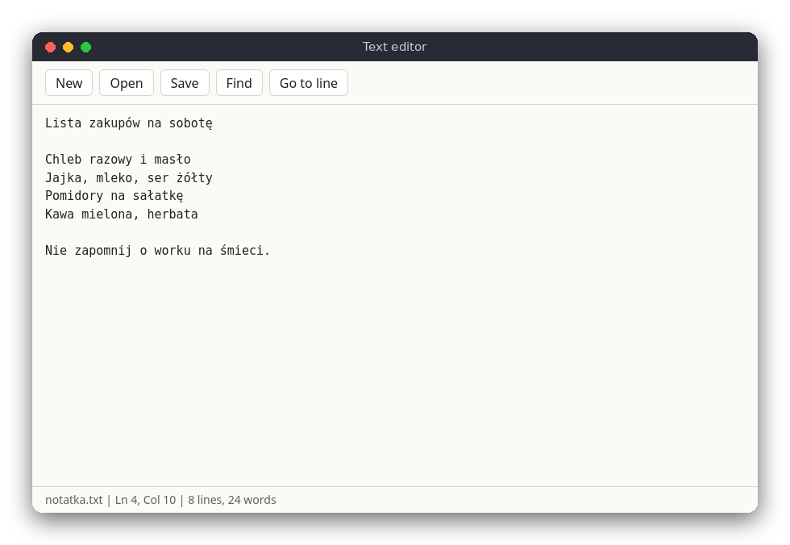

# Text Editor (JavaScript)

A small plain-text editor that runs in the browser, written in plain JavaScript with no libraries. You open a file, edit it, search it and save it. The text is kept by a `textarea` element, so the code to read is the logic for search and counting, and the code that connects the page to the keys and the status bar.

The same editor is also written in [C](../../c/text_editor) (ncurses terminal) and [Python](../../python/text_editor) (tkinter window). The editor works with plain text only, without bold, italic or colors, so the three versions have the same features and can be compared line by line.



## Features

- Open a file with the Open button (a file picker); the text appears in the editor
- Edit the text with the keyboard and the mouse; Tab inserts 4 spaces
- Save with Ctrl+S: the browser downloads the text as a file with the same name (a new file asks for a name)
- Find text with Ctrl+F, find the next match with F3; the search wraps around to the start of the text
- Go to a line with Ctrl+G
- A status bar with the file name, a `(modified)` marker, line and column, and the number of lines and words
- Warns before you open another file, start a new file or close the page with unsaved changes

## How to use

| Key or button | Action |
|---|---|
| Arrows, Home, End, PgUp, PgDn | Move the cursor (the mouse also works) |
| Letters, Enter, Tab | Type text, split the line, insert 4 spaces |
| Backspace, Delete | Delete the character before / after the cursor |
| Ctrl+S, **Save** | Download the text as a file |
| **Open** | Choose a file from your computer |
| **New** | Start an empty file |
| Ctrl+F, **Find** | Find text (a dialog asks for it) |
| F3 | Find the next match |
| Ctrl+G, **Go to line** | Go to a line number |

Ctrl+N and Ctrl+O are not used, because the browser reserves them for opening a new window and a file. Use the New and Open buttons instead. Closing the tab asks for confirmation when there are unsaved changes.

## How it works

### Files

A web page cannot write to the disk, so the file is never saved in place. Instead, `save` puts the text in a `Blob`, makes a temporary link to it with `URL.createObjectURL`, clicks the link, and the browser downloads the file. Open works the other way round: the hidden `<input type="file">` gives the chosen `File` to a `FileReader`, which reads it as text into the `textarea`.

### The logic

`src/text_editor.js` has the functions that do not touch the page, so the tests can call them:

- `findNext(text, needle, start)` returns the index of the first match at or after `start`. If there is none, it searches again from the beginning, so the search wraps around. It returns -1 when nothing matches.
- `lineCol(text, offset)` turns a character offset into a `{ line, column }` pair, counted from 1.
- `lineStart(text, line)` returns the offset of the first character of a line, which is how Go to line moves the cursor.
- `countLines(text)` and `countWords(text)` give the numbers in the status bar. A final newline does not start a new line, which is the same rule as in the C version.

The file is a classic script and not an ES module, and it ends with `module.exports`, so `node --test` can load it while the page still works when `index.html` is opened from disk.

### The page

`src/main.js` connects the page to the logic. The main parts:

- `editor.selectionStart` is the cursor position. `updateStatus` computes the line and column from it and writes the status bar and the page title.
- `isModified` compares the text with `savedText`, the text at the last open or save. There is no separate flag to keep in step.
- `findAgain` searches from the cursor plus one character, selects the match with `setSelectionRange` and reports whether the search wrapped around.
- The keyboard handler on `document` handles the shortcuts and calls `preventDefault`, so the browser does not also open its own Find dialog. Tab is intercepted to insert spaces with `execCommand('insertText')`, which keeps the undo history.
- The `beforeunload` event asks the browser to confirm closing the tab while the text is modified.

The text area does not wrap long lines, so a long line scrolls sideways, as in the C version.

## Project layout

```
package.json                  the test command (no dependencies)
src/index.html                the page: toolbar, text area, status bar
src/style.css                 the look, with light and dark colors
src/text_editor.js            the logic: search, line and column, counts (no DOM)
src/main.js                   the page: buttons, keys, file reading and saving
tests/text_editor.test.js     tests of the logic
```

## Requirements

- A modern browser (Chrome, Firefox, Edge or Safari) to use the editor
- Node.js 18 or newer to run the tests (no npm packages are needed)

## Run

Open `src/index.html` in the browser. There is no server and no build step.

## Test

```sh
npm test
```

This runs `node --test` on `tests/text_editor.test.js`, which checks the logic without a browser.

## Comparison with the other versions

- [C](../../c/text_editor): ncurses terminal, [README](../../c/text_editor/README.md)
- [Python](../../python/text_editor): tkinter window, [README](../../python/text_editor/README.md)

| | C | Python | JavaScript |
|---|---|---|---|
| Interface | ncurses terminal | tkinter window | browser page |
| Lines of logic | 298 | 22 | 35 |
| Lines of interface | 355 | 156 | 157 |
| Tests | 9 | 6 | 7 |

The browser gives the most for free: the `textarea` stores the text, the cursor and the selection, and the browser handles the file picker, the download and the close warning. The interesting differences are in saving: a terminal program writes straight to the file, the tkinter program uses a save dialog, and a web page can only download a copy. Search and counting are the same few string operations in all three languages, which makes this file the easiest to compare with the others.

## Ideas for extensions

- Keep the file name and text in `localStorage`, so a reload does not lose unsaved work
- Use the File System Access API (where the browser supports it) to save over the same file
- Highlight all matches of the search text
- Add Undo and Redo with the browser's own history (`execCommand('undo')`) or a stack of changes
- Show the line numbers in a column on the left
