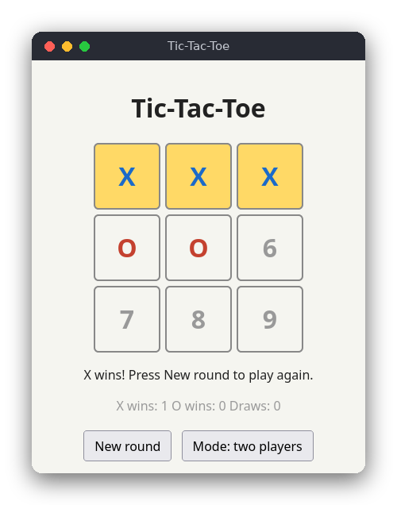

# Tic-Tac-Toe (JavaScript)

Tic-tac-toe ("Kółko i krzyżyk") in the browser. Two people can share the mouse, or you can play X against a computer that uses minimax and never loses. It needs no libraries and no server: open the page from disk.



## Features

- Two players on one computer, or a player against the computer.
- Wins are detected, the winning line is highlighted, and draws are reported.
- A score of X wins, O wins and draws is kept across rounds.
- New round and mode buttons.

## How to play

1. Click an empty cell to place your mark. Empty cells show their number.
2. In two-player mode, X and O take turns. In vs-computer mode you are X and the computer answers at once with O.
3. The first player with three marks in a row wins, and that row turns yellow.
4. Press **New round** to play again; the score is kept.
5. Press **Mode** to switch between two players and vs computer. This also starts a new round.

## How it works

### Data structures

The rules live in `src/tic_tac_toe.js`. A board is an array of nine values: `null` for an empty cell, or `'X'` or `'O'`, indexed row by row from 0 to 8. The eight winning lines are the array `LINES`. `winningLine()` returns the first line that is filled with one mark, or `null`. `play()` returns a copy of the array with the mark added and throws an error for a taken cell.

### Turns and the round

`src/main.js` holds one `state` object: the board, the player to move, the mode and the scores. `place()` updates the board, then either switches the turn or, when the round has ended, adds one to the right score. In vs-computer mode `onCellClick()` calls `bestMove()` after the human's move.

### The event loop

The browser calls the click handlers that `main.js` attached to the nine cell buttons. Each handler changes `state` and calls `render()`, which writes the board, the status and the scores to the page from `state`. Nothing on the page is kept as the source of truth.

### Win and draw

- `winner()` returns `'X'` or `'O'` when a line is complete, otherwise `null`.
- `isDraw()` is true when the board is full and there is no winner.

The file `src/tic_tac_toe.js` ends with `module.exports` guarded by `typeof module`, so the same file loads in the browser as a plain script and in Node.js for the tests.

### Minimax, step by step

The computer looks ahead through every possible continuation of the game and chooses the move that leads to the best result for it. Each finished game is scored from the computer's point of view:

- a win scores `10 - depth`,
- a loss scores `depth - 10`,
- a draw scores `0`,

where `depth` is the number of moves played from the position being scored. Subtracting the depth makes a quick win score higher than a slow one, and a slow loss score higher than a fast one, so the computer finishes a won game quickly and delays a lost one.

The search alternates between two players. On the computer's turn it takes the **maximum** score of its moves; on the opponent's turn it takes the **minimum**, because the opponent picks the reply that is worst for the computer. Recursion ends when a game is over.

Example. X has cells 0 and 1 and threatens to win on cell 2. O (the computer) has cells 4 and 8. It is O's turn:

```
X X 2        (empty cells are shown by their number)
3 O 5
6 7 O
```

1. The legal moves for O are 2, 3, 5, 6 and 7.
2. Move 3 (or 5, 6, 7) does not stop X. X plays 2 and wins at once. The win is found at depth 2, so the score is `2 - 10 = -8`.
3. Move 2 blocks the threat, and it also creates two threats for O: 6 (cells 2-4-6) and 5 (cells 2-5-8). X can stop only one of them, so O wins on its next move. That win is found at depth 3, so the score is `10 - 3 = 7`.
4. O compares the scores 7, -8, -8, -8, -8 and picks the maximum: cell 2.

The computer therefore never loses a game it can avoid losing. Two computers playing each other always end in a draw, which the tests check.

`bestMove()` loops over the legal moves, scores each one with `minimax()`, and keeps the first move with the highest score, so ties go to the lowest cell number.

## Project layout

```
package.json               the npm test script (no dependencies)
src/index.html             the page
src/style.css              the look, including dark mode
src/tic_tac_toe.js         the rules: board, legal moves, winner, draw, minimax (no DOM)
src/main.js                the page: cells, buttons and drawing
tests/tic_tac_toe.test.js  tests of the rules with node:test
```

## Requirements

- A modern web browser to play.
- Node.js 18 or newer to run the tests. There are no npm packages to install.

## Run

Open `src/index.html` in a browser. No server is needed.

## Test

```sh
npm test
```

The tests use only the logic module. They check the win and draw rules, illegal moves, the computer taking an immediate win, the computer blocking an immediate loss, and two computers always drawing.

## Comparison with the other versions

- [C (terminal, ncurses)](../../c/tic_tac_toe)
- [Python (tkinter window)](../../python/tic_tac_toe)
- [JavaScript (browser page)](../../vanilla_js/tic_tac_toe)

| | C | Python | JavaScript |
|---|---|---|---|
| Interface | ncurses terminal | tkinter window | browser page |
| Lines of logic | 142 | 53 | 82 |
| Lines of interface | 163 | 73 | 68 |
| Tests | 10 | 17 | 9 |

The rules and the minimax search are the same algorithm in all three versions, so the tests check the same positions. C stores the board in a fixed struct of nine values and copies it by value inside the search, so no memory is allocated; the winning line is a pointer into a static table. Python and JavaScript write each new position as a new list or array, which reads more like the rules but allocates a little more. The terminal version polls keys in a loop, while the other two react to button callbacks.

## Ideas for extensions

- Add a difficulty level that sometimes chooses a random legal move.
- Let the computer start every other round, so the score is fairer.
- Save the score in `localStorage` so it survives a page reload.
- Add keyboard support: the number keys 1 to 9 place a mark.
