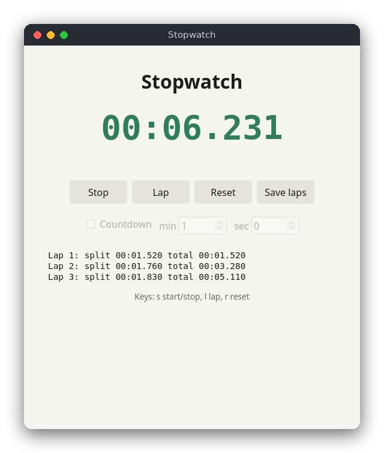

# Stopwatch and Countdown (JavaScript)

A stopwatch with laps and a countdown, in a web page. The page needs no server and no packages: open `src/index.html` in a browser. Laps can be downloaded as a `laps.txt` file, and a countdown shows "Time is up!" when it reaches zero.

The same program is also written in [C](../../c/timer) (a terminal version) and [Python](../../python/timer) (a tkinter window). They have the same features and rules.



## Features

- Stopwatch with milliseconds: `mm:ss.mmm`, or `h:mm:ss.mmm` after an hour.
- Start, stop (pause), resume, and reset.
- Laps, each with its split time (since the previous lap) and total time.
- Countdown with minutes and seconds. It stops by itself at zero and shows the alert in red.
- **Save laps** downloads the laps as `laps.txt`.
- Timing uses `performance.now()`, a monotonic clock, so changes to the system time do not affect it.

## How to use

- **Start** starts the timer, and then reads **Stop** to pause it. Start again to resume.
- **Lap** records a lap while the timer runs.
- **Reset** clears the time and the laps.
- **Save laps** downloads `laps.txt`. It is enabled once there is a lap.
- Tick **Countdown** and set the minutes and seconds before pressing Start. These settings are locked after the first start, until you press Reset.

Keyboard shortcuts (when no input field has the focus): `s` start or stop, `l` lap, `r` reset.

Example: press Start, then Lap three times, then Stop. The page lists the laps, and **Save laps** downloads:

```
Lap 1: split 00:01.542  total 00:01.542
Lap 2: split 00:01.257  total 00:02.799
Lap 3: split 00:01.036  total 00:03.835
```

## How it works

The code is in two classic scripts, not ES modules, so that the page also works when opened from disk (`file://`). `index.html` loads `timer.js` (the logic, no DOM) and then `main.js` (the page).

**Time values.** Every time is a whole number of milliseconds. The class `Timer` in `timer.js` never reads a clock. Its methods take `now` as an argument. The tests pass fixed numbers and do not wait.

**The stopwatch state.** `Timer` keeps `accumulatedMs` (the time of the finished running periods), `startedAtMs` (the clock value when the current period began) and `running`. `elapsed(now)` adds the current period while running. `start(now)` and `stop(now)` change these values, and they do nothing when the timer already is in the requested state. Pausing and resuming therefore keep the total correct.

**Laps.** `lap(now)` stores the total time now, and the split is the total minus the total of the previous lap. It returns `null` when the timer is not running. `lapsText` turns the laps into the lines of `laps.txt`.

**Countdown.** `new Timer(limitMs)` makes a countdown. `display(now)` returns the remaining time, and `elapsed` never goes past the limit. `tick(now)` stops the timer at zero. A finished countdown cannot be started again until `reset()`.

**Why a monotonic clock.** `Date.now()` returns the wall clock, which the operating system sets. It can jump when the clock is synchronized or the time zone changes, so the difference between two readings can be wrong. `performance.now()` counts milliseconds since the page loaded and never goes backwards. `main.js` only subtracts two readings.

**The page.** `main.js` reads the buttons, the inputs and the keys. Every 20 ms, `tick()` updates the timer, and `refresh()` writes the time into the display and sets the CSS classes `running` and `finished`. Saving creates a `Blob` with the laps text and clicks a temporary link with `download="laps.txt"`.

## Project layout

```
README.md            this file
screenshot.png       a running stopwatch with three laps
package.json         the test command (npm test) and no dependencies
src/index.html       the page: buttons, countdown inputs, laps list
src/style.css        the layout and the light and dark colors
src/timer.js         the logic: Timer, countdownMs, formatTime, lapsText
src/main.js          the page logic: buttons, keys, display, download
tests/timer.test.js  tests of the logic with fixed times
```

## Requirements

- A modern browser (Chrome, Firefox, Safari or Edge)
- Node.js 18 or newer, only for the tests (the page itself needs no Node)

## Run

Open `src/index.html` in a browser. There is nothing to build or install.

## Test

```sh
npm test
```

The tests use the built-in `node:test` runner and do not need a browser.

## Comparison with the other versions

- [C version](../../c/timer): terminal program
- [Python version](../../python/timer): tkinter window

| | C | Python | JavaScript |
|---|---|---|---|
| Interface | terminal (ANSI codes) | tkinter window | browser page |
| Lines of logic | 136 | 73 | 75 |
| Lines of interface | 199 | 105 | 102 |
| Tests | 9 | 11 | 9 |

The JavaScript logic follows the same rules as the Python logic, with the same names in camel case. The differences are in the details: JavaScript uses a class with methods and `null` for "no lap", and a `Blob` for the download, where Python writes a file directly. In C the same rules need more code, because the program manages its own array of laps and text buffers.

## Ideas for extensions

- Store the laps in `localStorage`, so they survive a page reload.
- Let the countdown repeat (pomodoro: 25 minutes work, 5 minutes rest).
- Play a short sound with the Web Audio API when the countdown ends.
- Add a dark-mode switch that sets `data-theme` on the `<html>` element.
- Use `requestAnimationFrame` instead of `setInterval` for smoother digits.
