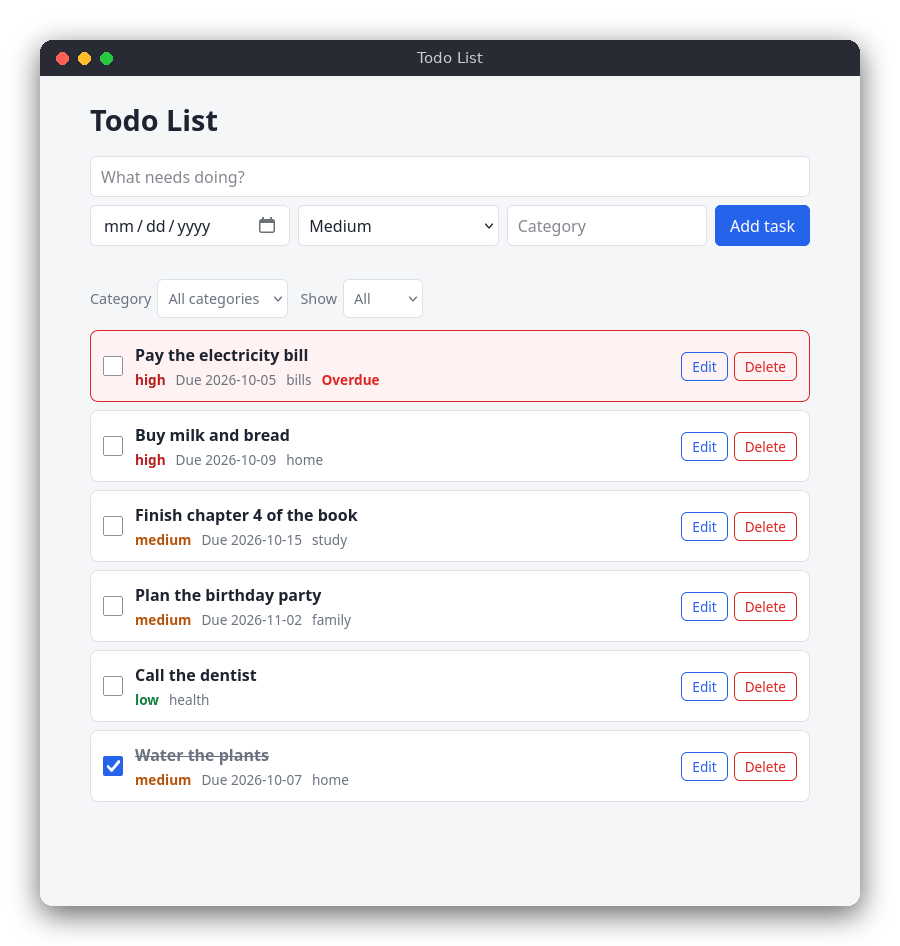

# Todo List (JavaScript)

A todo list in the browser. Each task has a title, a priority (low, medium or high), an optional due date and an optional category. The tasks are saved in the browser's `localStorage`, so they are still there after the page is closed.



## Features

- Add, edit, delete, mark done and mark not done
- Priorities, due dates (checked against the calendar) and categories
- The list is sorted by done status, then due date, then priority
- Filter by category, or show all, active or done tasks
- Overdue tasks (not done, due before today) are red and marked "Overdue"
- No installation: open the page in a browser

## How to use

1. Type a title in the first field. Optionally pick a due date, a priority and a category.
2. Press **Add task**.
3. Tick the checkbox to mark a task as done. Untick it to mark it as not done.
4. Press **Edit** to load a task into the form. Change it and press **Save changes**, or press **Cancel**.
5. Press **Delete** to remove a task.
6. Use the two lists above the tasks to show only one category, or only active or done tasks.

## How it works

### The data

A task is a plain object: `{ id, title, priority, due, category, done }`. The due date is `YYYY-MM-DD` or an empty string, the category is an empty string when there is none. All tasks are kept in one array, `tasks`, in `src/main.js`. The array is saved as JSON under the key `todo.tasks` in `localStorage`. When the page loads, the JSON is read and checked by `tasksFromJson`; if it is damaged, the page starts with an empty list and the next save replaces the damaged data.

### Rules (`src/todo.js`)

- `isValidDate` uses a regular expression for the `YYYY-MM-DD` form, then checks the month and the number of days in that month (leap years included).
- `isValidTask` checks the title (not empty, at most 255 bytes), the category (at most 63 bytes), the priority and the due date. Tabs and new lines are refused, as in the other two versions. The byte length is measured with `TextEncoder`, so Polish letters count as two bytes.
- `isOverdue` is true when the task is not done, has a due date, and the date is earlier than today.
- `visibleTasks` filters the tasks and sorts them with `compareTasks`: active tasks first, then tasks with a due date (earliest first, tasks without a date last), then high priority first, then the id.
- `formatDate` turns a `Date` into `YYYY-MM-DD` in local time. The page calls it once per redraw, so "overdue" is always compared with the current day.

### The page (`src/main.js`, `src/index.html`)

`index.html` loads `todo.js` first, so its functions are global, and then `main.js`. `main.js` has no drawing library: `render()` builds the list with `document.createElement` and `replaceChildren`. Text is always set with `textContent`, so a title such as `<b>` is shown as text and never as HTML.

The page reacts to events: the form submits to `handleSubmit`, the checkboxes and the Edit and Delete buttons are handled by one listener on the list (event delegation), and the two filter lists call `render()`. After every change the code updates `tasks`, saves it and draws the list again. The form remembers which task is being edited in `editingId`.

## Project layout

```
README.md
package.json           the test command (npm test); there are no dependencies
src/index.html         the page
src/style.css          the layout, the colors and dark mode
src/todo.js            the logic: validation, dates, sorting, filtering, JSON
src/main.js            the page: the form, the filters, the list, localStorage
tests/todo.test.js     tests of the logic, run with node:test
```

## Requirements

- A modern browser (Chrome, Firefox, Safari or Edge from 2021 on)
- Node.js 18 or newer, only to run the tests. The page itself needs no Node.js.

## Run

Open `src/index.html` in the browser. The page works from the file system (`file://`), so no server is needed.

## Test

```sh
npm test
```

## Comparison with the other versions

- [C version](../../c/todo)
- [Python version](../../python/todo)

| | C | Python | JavaScript |
|---|---|---|---|
| Interface | terminal commands | terminal commands | browser page |
| Lines of logic | 239 | 76 | 79 |
| Lines of interface | 273 | 136 | 180 |
| Tests | 7 | 10 | 7 |

The browser version keeps everything in memory and saves the whole list as JSON, so it needs no text format and no file handling. Its rules are the same as the C and Python versions, but the code has to handle events and drawing, which makes `main.js` the longest part. The logic file has no DOM calls, so the same tests run with Node.js without a browser. Where C copies strings into fixed arrays and Python builds new lists, JavaScript simply creates new objects and arrays with `map` and `filter`.

## Ideas for extensions

- Drag and drop to reorder tasks.
- Export and import the tasks as a JSON file.
- Keyboard shortcuts, for example `n` to focus the title field.
- Show a count of overdue tasks in the page title.
