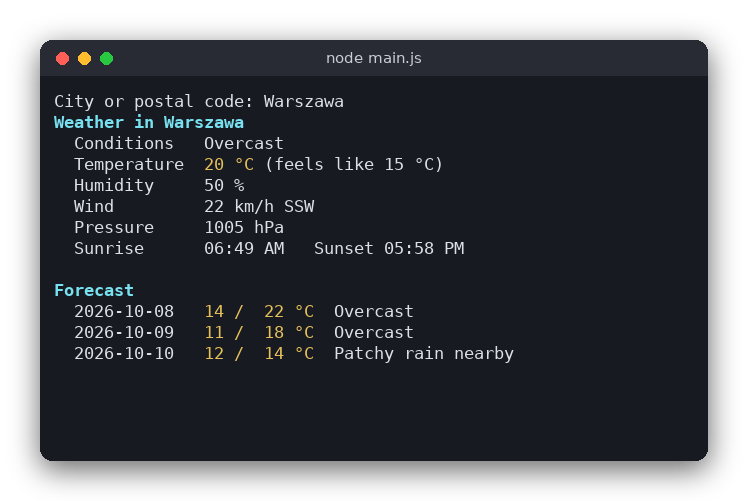

# Weather (JavaScript)

A command-line weather report. You type a city name or postal code, and the program downloads the current weather and a 3-day forecast from [wttr.in](https://wttr.in), a free service that needs no API key. The program runs on Node.js 18 or newer, uses only the built-in modules and has no npm dependencies.

The same program is also written in [C](../../c/weather) and [Python](../../python/weather). All three print the same report.



## Features

- Current temperature, feels-like temperature, conditions, humidity, wind speed and direction, pressure, sunrise and sunset
- A 3-day forecast with the minimum and maximum temperature and the conditions for each day
- Works with city names (`Warszawa`, `New York`, `Kraków`) and postal codes (`00-001`)
- Clear error messages for an unknown city, no network connection, or an empty reply
- Colors for the title, the temperatures and the section headings

## How to use

Give the city as an argument:

```sh
node src/main.js Warszawa
```

Several words are joined into one name, so `node src/main.js New York` also works. Without an argument the program asks for the city:

```text
$ node src/main.js
City or postal code: Warszawa
Weather in Warszawa
  Conditions   Overcast
  Temperature  20 °C (feels like 15 °C)
  Humidity     50 %
  Wind         22 km/h SSW
  Pressure     1005 hPa
  Sunrise      06:49 AM   Sunset 05:58 PM

Forecast
  2026-10-08  14 /  22 °C  Overcast
  2026-10-09  11 /  18 °C  Overcast
  2026-10-10  12 /  14 °C  Patchy rain nearby
```

Errors are printed to standard error and the program exits with status 1:

```text
$ node src/main.js zzzzqqq
City not found: zzzzqqq (HTTP 500)
```

## How it works

**Getting the data.** The global `fetch()` function (available since Node 18) downloads the reply. The program makes one request with `?format=j1`, which returns the current weather and the forecast as JSON. `AbortSignal.timeout()` stops the request after 10 seconds. wttr.in answers HTTP 500 for a place it does not know, so a response with `ok === false` is reported as an unknown city. A `fetch` that throws (no connection, DNS failure) is reported as a network error, and the error code from `error.cause` is shown.

**Building the URL.** `buildUrl()` uses `encodeURIComponent(city)`. This turns spaces into `%20` and Polish letters into their UTF-8 bytes (`ó` becomes `%C3%B3`). A slash becomes `%2F`, so a city name cannot change the path of the URL.

**Parsing the reply.** `parseWeather()` calls `JSON.parse()` and copies the values it needs into a plain object with camelCase names. It reads `current_condition[0]` for the current values, and the `weather` array for the sunrise and sunset and for the three forecast days. Each forecast day stores its minimum and maximum temperature and the description of the 12:00 slot (`hourly[4]`, since wttr.in gives eight 3-hour slots per day). Numbers are converted with `parseInt()`, which throws if the value is missing. Any error in the reply is turned into one message, `unexpected weather data`.

**Formatting.** `formatReport()` joins the lines of the report with `\n`. `padStart()` lines up the temperatures. The report contains ANSI color codes, so the text looks colored in a terminal.

**The user interface.** `main.js` takes the city from the command line, or asks for it with `readline`. `process.exitCode = 1` makes errors return status 1 while still printing the message to standard error.

## Project layout

```
weather/
├── package.json          the name, the Node version and the test command (no dependencies)
├── README.md             this file
├── screenshot.png        the program running for Warszawa
├── src/
│   ├── weather.js        URL building, parsing of the JSON reply, report formatting
│   └── main.js           asks for the city, downloads the reply, prints the report
└── tests/
    ├── weather.test.js   tests of the logic, using warszawa.json
    └── warszawa.json     a saved wttr.in reply (format=j1) for Warszawa
```

## Requirements

- Node.js 18 or newer (for `fetch` and `AbortSignal.timeout`)
- An internet connection to run the program (the tests do not need one)

## Run

```sh
node src/main.js Warszawa
```

## Test

```sh
npm test
```

The tests use `node:test`. They check the URL encoding, the parsing of the saved reply (current conditions and the forecast), the rejection of bad replies, and the report text.

## Comparison with the other versions

- [C version](../../c/weather)
- [Python version](../../python/weather)

| | C | Python | JavaScript |
|---|---|---|---|
| Interface | Terminal, `curl` through `popen()` | Terminal, `urllib` | Terminal, `fetch` |
| Lines of logic | 177 | 77 | 62 |
| Lines of interface | 100 | 33 | 50 |
| Tests | 9 | 9 | 7 |

JavaScript and Python read the reply with a built-in JSON parser, so the parsing code is short in both. The difference is in the downloading: `fetch` returns a promise, so the program uses `async` and `await`, and a failed request shows up as a rejected promise rather than an exception in the middle of the code. In C, the same work needs a child process running `curl`, a buffer that grows as the reply arrives, and a hand-written search through the text, which is why the C logic is the longest of the three.

## Ideas for extensions

- Add a `--units imperial` option to show Fahrenheit and mph
- Show how many hours of daylight there are, computed from the sunrise and sunset times
- Cache the last reply in a file and show it when the network is down
- Show the hourly forecast for the rest of the day
- Read the default city from an environment variable
