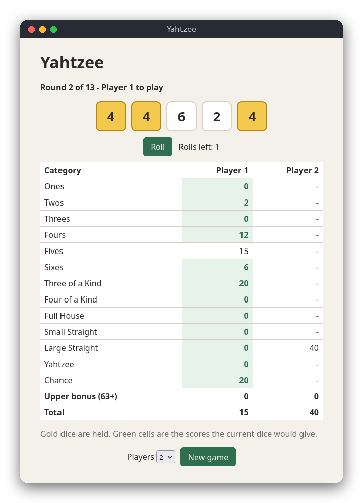

# Yahtzee (JavaScript)

Yahtzee is a dice game for 1 to 4 players who take turns on one computer. In each turn you roll five dice up to three times, hold the dice you like between rolls, and then write the result into one free category of your score card. This version runs in a web page with plain JavaScript, HTML and CSS. It needs no packages and no server.

The same game is also written in [C](../../c/yahtzee) (terminal) and [Python](../../python/yahtzee) (tkinter window).



## Features

- 1 to 4 players, taking turns, 13 rounds
- Up to three rolls per turn, holding any dice between rolls
- The 13 standard categories: Ones to Sixes, Three of a Kind, Four of a Kind, Full House (25), Small Straight (30), Large Straight (40), Yahtzee (50) and Chance
- The green cells on the score card show what the current dice would score
- Upper bonus: 35 points when the upper section reaches 63
- The winner is shown at the end
- Not included: the optional Yahtzee bonus and joker rules

## How to use

Open `src/index.html` in a browser. Choose the number of players and press **New game** to start again at any time.

1. Press **Roll** to roll all five dice.
2. Click a die to hold it (it turns gold). Click it again to release it.
3. Press **Roll** again to roll the dice that are not held. You have three rolls in total.
4. Click a green cell in your column to write that score. The turn ends and the next player starts.

Filled cells are fixed. The game ends after 13 rounds and shows the winner.

## How it works

The code is split into two files:

- `src/yahtzee.js` contains the rules. It has no DOM code, so the tests can run it in Node.js.
- `src/main.js` reads and changes the page: the dice buttons, the roll button and the score table.

The files are classic scripts, not ES modules, so the page also works when opened directly from disk (`file://`). `yahtzee.js` ends with a line that exports the functions only when `module` exists, which is the case in Node.js.

**Data.** A game is a plain object: `cards` holds one array of 13 values per player (`null` means the category is still free), `dice` and `held` hold the five dice, `rolls` counts the rolls in this turn, and `current` and `round` say whose turn it is.

**Scoring.** `scoreFor(dice, category)` counts how many dice show each face. The upper categories add up the dice showing their face. Three and Four of a Kind add all dice when there are enough equal faces. Full House needs exactly three of one face and two of another. A straight is a run of faces (four for the small one, five for the large one). Yahtzee needs five equal dice. Chance adds all dice.

**Turn flow.** `rollDice(game, face)` rolls the dice that are not held. It takes a function `face()` that returns a number from 1 to 6. `main.js` passes a function that turns `Math.random()` into a face. `toggleHold` works only after the first roll. `chooseCategory` writes the score, resets the dice and moves to the next player. When the last player has finished, the round goes up, and `isOver(game)` is true after round 13.

**Page loop.** There is no game loop: each click calls one logic function and then `render()`, which redraws the status text, the dice and the score card from the game object.

## Project layout

```
package.json            project name and the test command (npm test)
src/index.html          the page: dice, buttons and the empty score table
src/style.css           layout and colours (light and dark mode)
src/yahtzee.js          the rules: scoring, turns, rounds, upper bonus, winner
src/main.js             the page: draws the dice and the table and handles clicks
tests/yahtzee.test.js   tests of the rules with fixed dice (node:test)
```

## Requirements

- A modern browser to play (Chrome, Firefox, Edge or Safari)
- Node.js 18 or newer, only for the tests (no npm packages are needed)

## Run

Open `src/index.html` in a browser. Nothing has to be installed or started.

## Test

```
npm test
```

The tests check the score of each category with a table of dice, the upper bonus threshold, the totals, holding and rolling limits, the turn order, the rule that a category is used once, a full game of 13 rounds, and the winner.

## Comparison with the other versions

- [C](../../c/yahtzee)
- [Python](../../python/yahtzee)
- [JavaScript](../../vanilla_js/yahtzee) (this version)

| | C | Python | JavaScript |
|---|---|---|---|
| Interface | terminal (stdin/stdout) | tkinter window | browser page |
| Lines of logic | 212 (159 + 53 header) | 107 | 139 |
| Lines of interface | 171 | 121 | 110 (+ 45 HTML) |
| Tests | 10 | 24 | 10 |

In the browser, the score table is rebuilt from the game object after every click, so the page never has to remember what it already shows. The C version keeps its state in structs passed by pointer, and the Python version uses a class with methods. JavaScript uses plain objects and functions, and the event handlers are short because each click only calls one rule function and then redraws. The price is that nothing stops a mistake in a field name, so this version is the one that most needs the tests.

## Ideas for extensions

- Add the optional Yahtzee bonus (100 points per extra Yahtzee) and the joker rules.
- Save the game in `localStorage` so a refresh does not lose it.
- Let players type their names.
- Add an animation for the dice rolls with CSS transitions.
