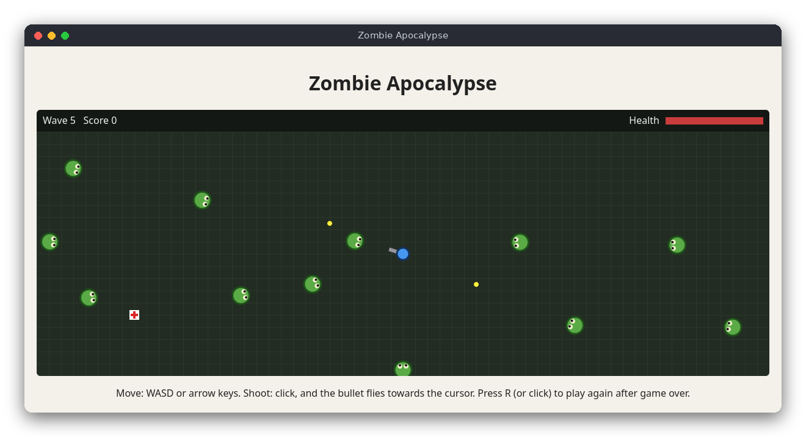

# Zombie Apocalypse (JavaScript)

A small top-down survival game in the browser, drawn on a canvas. You stand in the middle of a field, zombies walk in from the edges, and you shoot them before they touch you. Every wave brings more and faster zombies, and health packs appear now and then.

The same game is also written in [C](../../c/zombie_apocalypse) (ncurses terminal) and [Python](../../python/zombie_apocalypse) (pygame). All three follow the same rules.



## Features

- Move with **WASD** or the arrow keys; you cannot leave the field
- Shoot with the **mouse**: a click fires a bullet towards the cursor
- Zombies appear on the edges of the field and walk towards you
- Each wave has more zombies (5, then 8, 11, ...) and they are faster
- Touching a zombie costs 10 health and destroys the zombie
- Health packs (white squares with a red cross) appear every 12 seconds (at most two on the field) and restore 25 health
- Each zombie you shoot gives 10 points
- The top bar shows the wave, the score and the health bar
- The screen flashes red when you get hurt
- Game over when health reaches 0; press **R** or click to play again

## How to play

Open `src/index.html` in a browser (double-click it, no server needed), then:

| Key or mouse | Action |
|---|---|
| `W` `A` `S` `D` or arrows | Move |
| Click | Shoot towards the cursor (one bullet per click, with a short pause between shots) |
| `R` or click | Play again (after game over) |

The blue circle is you, with a gray gun barrel pointing at the cursor. Green circles with eyes are zombies, yellow dots are bullets and white squares with a red cross are health packs.

## How it works

The game is split into two classic scripts (not ES modules, so the page also works when opened from disk). `src/zombie_apocalypse.js` holds the rules and has no DOM code. `src/main.js` reads the keyboard and mouse, calls the rules once per frame and draws on the canvas. `src/index.html` loads both files and `src/style.css` styles the page.

**Data.** The state is a plain object created by `newGame(seed)`. Positions are `{x, y}` objects in cells: the field is 60 x 20 cells, and each cell is 20 pixels on the canvas. Bullets are `{pos, vel}` objects, and an `input` object `{moveX, moveY, aimX, aimY, fire}` holds one step's requests.

**One step.** Each animation frame `main.js` builds the input and calls `update(state, input, dt)`, where `dt` is the time since the last frame (at most 0.05 seconds). `update` does these things in order:

1. `movePlayer`: move by `PLAYER_SPEED * dt` in the chosen direction. The direction is normalized, so diagonals are not faster, and the player stays inside the field. The direction is also stored as `facing`.
2. `tryFire`: when a click happened since the last frame and the cooldown has ended, add a bullet at the player's position, flying towards the aim point. With no aim, it flies in the `facing` direction.
3. `moveBullets`: move the bullets and drop the ones that left the field.
4. `spawnZombies`: during a wave, one zombie appears on a random edge every `spawnInterval` seconds until all the wave's zombies are out.
5. `moveZombies`: each zombie moves towards the player at the wave's speed.
6. `resolveBulletHits`: a zombie closer than 0.6 to a bullet is removed together with the bullet, and the score goes up by 10.
7. `resolveZombieTouches`: a zombie closer than 1.0 to the player is removed and costs 10 health. At 0 health `gameOver` is set, and `update` does nothing more.
8. `resolvePickups` and `spawnPickups`: a health pack heals 25 (up to 100) when touched, and a new one appears every 12 seconds.
9. `updateWaves`: when the field is empty, a 3-second break starts; then the next wave begins with more zombies and a higher speed (`waveSize`, `zombieSpeed`).

**Randomness.** `nextRandom(state)` is a 32-bit linear congruential generator using `Math.imul`, with its state stored in the game object. The same seed gives the same spawns, which the tests rely on. `main.js` seeds a new game with `Math.random`.

**The interface loop.** `main.js` uses `requestAnimationFrame`. Each frame it reads the keys from a `Set` that `keydown` and `keyup` maintain, computes the aim from the mouse position (converted from CSS pixels to canvas pixels), calls `update` and redraws everything. A click is recorded in the `mousedown` handler and turned into one shot on the next frame, so a short click is never lost. When the health goes down, `flash` is set and the red overlay fades out over 0.3 seconds.

## Project layout

```
README.md                          this file
screenshot.png                     a wave in progress
package.json                       the test command (npm test), no dependencies
src/index.html                     the page: loads the two scripts below
src/style.css                      colors (light and dark) and the layout
src/zombie_apocalypse.js           the rules: movement, shooting, zombies, waves, pickups
src/main.js                        the canvas interface: input and drawing
tests/zombie_apocalypse.test.js    15 tests of the rules (node:test)
```

## Requirements

- A modern browser (Chrome, Firefox, Edge, Safari) to play
- Node.js 18 or newer, only to run the tests. There are no npm dependencies.

## Run

Open `src/index.html` in a browser. Nothing needs to be installed, and no web server is needed.

## Test

```sh
npm test
```

The tests load the rules file directly, so they need no browser and no input.

## Comparison with the other versions

- [C](../../c/zombie_apocalypse)
- [Python](../../python/zombie_apocalypse)
- [JavaScript](../../vanilla_js/zombie_apocalypse) (this version)

| | C | Python | JavaScript |
|---|---|---|---|
| Interface | ncurses terminal | pygame window | browser page |
| Lines of logic | 232 | 202 | 224 |
| Lines of interface | 155 | 138 | 218 |
| Tests | 15 | 15 | 15 |

The rules are the same in all three versions, and so is the random generator, so a given seed produces the same zombie spawns in each. JavaScript has no types to declare, so the state is a plain object and positions are created as new objects; that is simple, but the garbage collector does the cleanup that C does by hand. The browser makes the mouse easy to use, and its canvas needs an animation loop with a frame time, the same as pygame. The page is opened straight from disk, so it runs with no installation at all.

## Ideas for extensions

- Show a short explosion or blood splat where a zombie dies
- Add a second kind of zombie that is slower but takes two hits
- Save the best score in `localStorage`
- Let the player hold the mouse button to fire continuously, with the same cooldown
- Add touch controls for phones
